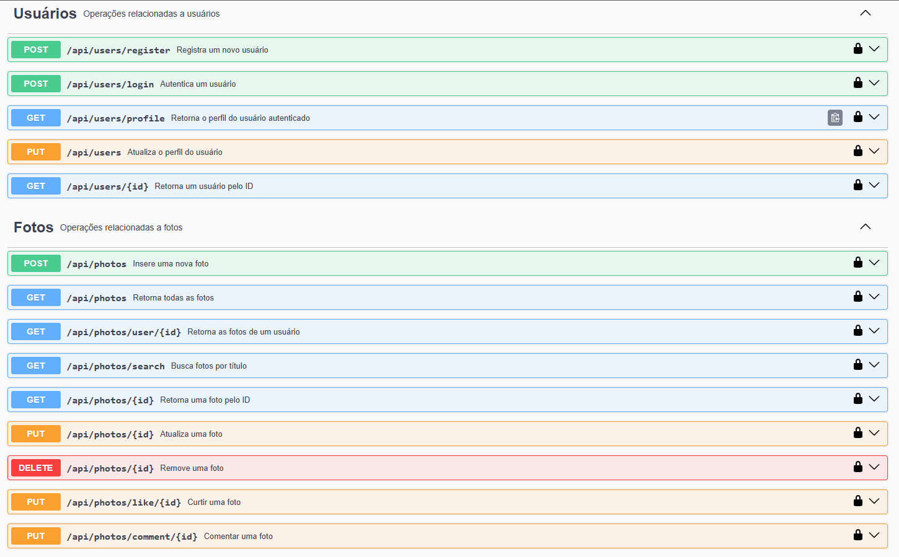

# ReactGram - Backend

Esse é o backend do ReactGram, uma aplicação fullstack inspirada no Instagram, com funcionalidades como cadastro de usuários, autenticação, postagem de fotos, curtidas, comentários e muito mais. Este repositório contém a API que será consumida pelo frontend em React.

## Funcionalidades Principais

### Usuários

- **Registro de usuários**: Crie uma conta fornecendo nome, e-mail, senha e confirmação de senha.
- **Autenticação**: Faça login com e-mail e senha para receber um token JWT.
- **Perfil do usuário**: Acesse e atualize seu perfil, incluindo nome, senha, biografia e imagem de perfil.
- **Busca de usuários**: Encontre outros usuários pelo ID.

### Fotos

- **Postagem de fotos**: Envie fotos com um título.
- **Curtidas**: Curta ou remova sua curtida de uma foto.
- **Comentários**: Adicione comentários às fotos.
- **Busca de fotos**: Encontre fotos por título.
- **Listagem de fotos**: Veja todas as fotos ou apenas as fotos de um usuário específico.

## Tecnologias Utilizadas

- **Node.js**: Ambiente de execução JavaScript.
- **Express**: Framework para construção da API.
- **MongoDB**: Banco de dados NoSQL para armazenamento de dados.
- **Mongoose**: Biblioteca para modelagem de dados do MongoDB.
- **JWT (JSON Web Tokens)**: Autenticação e gerenciamento de sessões.
- **Multer**: Middleware para upload de arquivos (imagens).
- **Swagger**: Documentação da API.
- **Bcrypt**: Criptografia de senhas.
- **CORS**: Middleware para permitir requisições de diferentes origens.

## Como Rodar o Projeto Localmente

### Pré-requisitos

- Node.js (v18 ou superior)
- MongoDB (local ou Atlas)
- Git (opcional)

### Passos

1. **Clone o repositório**:

    ```bash
    git clone https://github.com/Vinicius-b-oliveira/ReactGram_Backend.git
    cd reactgram-backend
    ```

2. **Instale as dependências**:

    ```bash
    npm install
    ```

3. **Configure as variáveis de ambiente**:
   Crie um arquivo `.env` na raiz do projeto e adicione as seguintes variáveis:

    ```env
    PORT=5000
    CORS_ORIGIN=http://localhost:5173
    DB_USER=seu_usuario_mongodb
    DB_PASS=sua_senha_mongodb
    JWT_SECRET=sua_chave_secreta_jwt
    ```

4. **Inicie o servidor**:
    ```bash
    npm run server
    ```

O servidor estará rodando em `http://localhost:5000`.

### Acesse a documentação da API

Acesse `http://localhost:5000/api-docs` para visualizar a documentação completa da API no Swagger UI.

#### Visualização das Rotas no Swagger



## Variáveis de Ambiente

| Variável    | Descrição                                 | Exemplo               |
| ----------- | ----------------------------------------- | --------------------- |
| PORT        | Porta em que o servidor será executado.   | 5000                  |
| CORS_ORIGIN | URL do frontend que pode acessar a API.   | http://localhost:5173 |
| DB_USER     | Usuário do banco de dados MongoDB.        | seu_usuario_mongodb   |
| DB_PASS     | Senha do banco de dados MongoDB.          | sua_senha_mongodb     |
| JWT_SECRET  | Chave secreta para geração de tokens JWT. | sua_chave_secreta_jwt |

## Estrutura do Projeto

```
reactgram-backend/
├── src/
│   ├── config/          # Configurações do banco de dados
│   ├── controllers/     # Lógica das rotas
│   ├── middlewares/     # Middlewares de autenticação e validação
│   ├── models/          # Modelos do MongoDB
│   ├── routes/          # Definição das rotas
│   ├── app.js           # Ponto de entrada da aplicação
│   └── swagger.json     # Documentação da API
├── uploads/             # Armazenamento de imagens enviadas
│   ├── photos/          # Imagens de postagens
│   └── users/           # Fotos de perfil
└── .env.example         # Exemplo de arquivo de variáveis de ambiente
```

## Contribuição

Contribuições são bem-vindas! Siga os passos abaixo:

1. Faça um fork do repositório.
2. Crie uma branch para sua feature:
    ```bash
    git checkout -b feature/nova-feature
    ```
3. Commit suas mudanças:
    ```bash
    git commit -m "Adiciona nova feature"
    ```
4. Faça push para a branch:
    ```bash
    git push origin feature/nova-feature
    ```
5. Abra um Pull Request.

---
